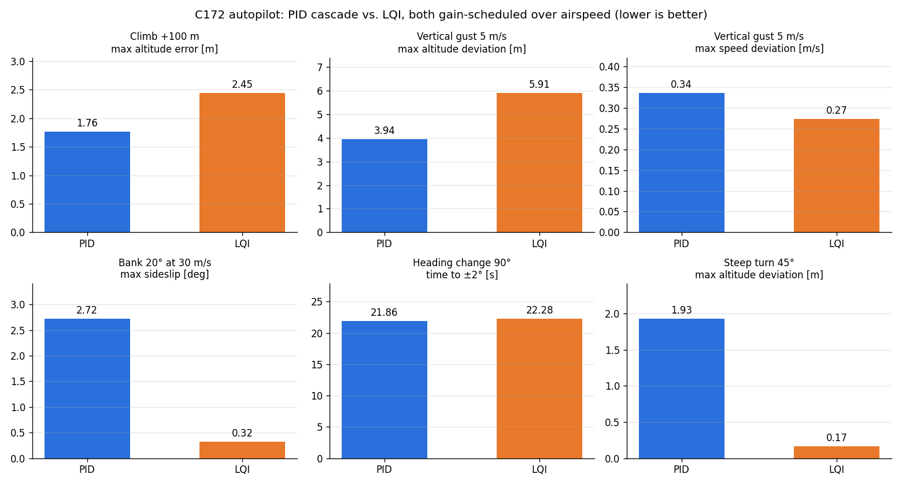
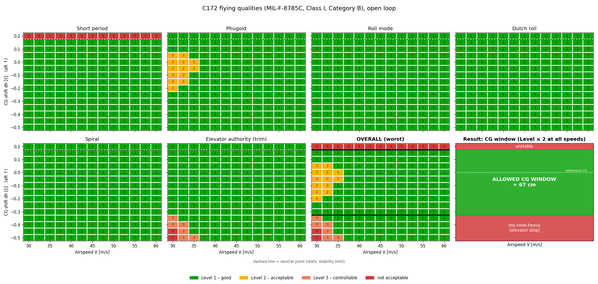
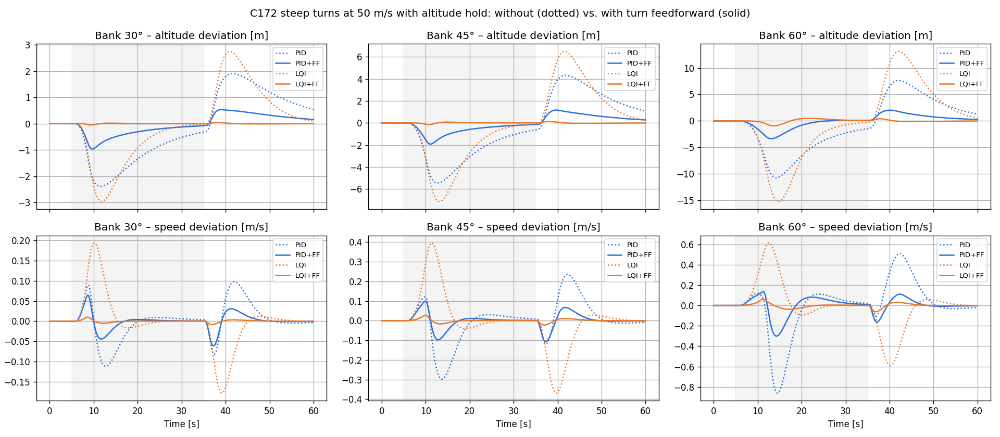

# Flight Control System – 6-DOF Simulation, Flying Qualities and Autopilot Design

A nonlinear 6-DOF flight simulation of a light aircraft (Cessna 172) in Python, used to
analyse its flying qualities against MIL-F-8785C and to design and compare two autopilot
architectures: a classical **PID cascade** and a **gain-scheduled LQI** (state-space
optimal control with integral action).



## Key results

- **Feedforward matters more than the controller type.** A climb-rate feedforward cut the
  altitude error during a +100 m climb from 25 m (PID) and 10 m (LQI) to below 3 m for both;
  a turn feedforward from the 6-DOF turn trim reduced the altitude loss in a 60° steep turn
  from 11 m to 3 m (PID) and from 15 m to 1 m (LQI).
- **On single-axis tasks a well-tuned PID is as good as LQI** (climb, gust rejection,
  heading capture).
- **On coupled tasks LQI wins clearly.** It moves aileron and rudder together and keeps the
  turn coordinated: max sideslip at 30 m/s is 0.3° (LQI) vs. 2.7° (PID, also gain-scheduled).
  About half of the advantage comes from gain scheduling, the rest from the MIMO structure.
- **Transferable:** the aircraft is selected by a parameter file. The same pipeline on a second
  model (Cessna 182) gives the same picture without re-tuning; LQI gains are recomputed
  automatically from the model.

## What is inside

**Flight dynamics**
- Nonlinear 6-DOF rigid-body model in body axes (Euler 3-2-1, NED), RK4 integration
- Aerodynamic model with stability derivatives incl. the α̇ term; CG shift via moment transfer
- Trim for straight flight and coordinated level turns (`scipy.optimize.fsolve`)
- Linearisation by central differences → A (12×12), B (12×4)

**Flying-qualities analysis**
- Automatic identification of the five eigenmodes (short period, phugoid, roll, Dutch roll, spiral)
  from the eigenvectors
- Level 1–3 rating per MIL-F-8785C (Class I, categories B and C), checked against the standard
- Level maps over airspeed × CG position, incl. elevator authority → usable CG window



**Autopilots** (all run on the nonlinear 6-DOF model)

| Task | PID | LQI |
|---|---|---|
| Altitude + airspeed hold | altitude → pitch → elevator cascade, speed PI on thrust | one MIMO controller, δe and thrust |
| Bank angle hold | PID on φ (aileron) + yaw damper with β feedback (rudder) | one MIMO controller, δa and δr, tracks φ and β = 0 |
| Heading hold | outer loop: heading error → turn rate → bank command | same outer loop |
| Steep turns | turn feedforward (pitch, elevator, thrust, pitch rate) | same feedforward |

Common features: gain scheduling over airspeed (PID: surface gains ∝ (V_ref/V)²; LQI: designed
at 30–65 m/s and interpolated at the measured speed), anti-windup, command rate limiters,
bumpless start. Robustness is tested over airspeed (30/50/65 m/s) and CG position (forward/aft)
with a 1-cos gust; runs are parallelised with `multiprocessing`.



## Project structure

| File | Content |
|---|---|
| `aircraft.py`, `c172_params.py`, `c182_params.py` | aircraft selection and parameter sets (SI units) |
| `flightdynamics_6dof.py` | nonlinear 6-DOF equations of motion, RK4 step |
| `trim_6dof.py` | trim (straight and turning flight) and linearisation |
| `validate_6dof.py` | check of the 6-DOF model against the earlier 3-DOF model |
| `modes.py`, `criteria.py` | eigenmode identification, MIL-F-8785C levels |
| `level_map.py`, `cg_analysis.py`, `compare_aircraft.py` | level maps, CG window, C172 vs. C182 |
| `autopilot_lon.py`, `autopilot_lon_lqi.py` | longitudinal autopilot: PID cascade and LQI |
| `robustness_lon.py` | robustness study (speed × CG × gust/climb), parallel |
| `autopilot_lat.py`, `autopilot_lat_lqi.py` | lateral autopilot: PID and LQI |
| `autopilot_heading.py` | heading hold on top of either bank controller |
| `turn_ff.py`, `turn_coupled.py` | turn feedforward and steep-turn test |
| `compare_all.py` | summary comparison (figure above) |
| `flightdynamics.py`, `trim.py`, `linearize.py`, `controller.py`, `simulation.py`, `pitch_design.py`, `lqi.py`, `compare_pid_lqi.py`, `gain_scheduling.py` | earlier longitudinal 3-DOF model and first controller designs |

## Getting started

```bash
pip install -r requirements.txt
python compare_all.py          # PID vs. LQI on all tasks (C172) -> results/compare_all_c172.png
python compare_all.py c182     # same for the Cessna 182
python criteria.py             # flying-qualities levels of the bare aircraft
python turn_coupled.py         # steep turns with/without turn feedforward
```

Every script writes its figure to `results/`.

## Data sources and assumptions

- Cessna 172 aerodynamic data: UIUC flight-simulation model; Cessna 182: Roskam,
  *Airplane Flight Dynamics and Automatic Flight Controls*, Part I, Appendix B (cruise).
- Flying-qualities limits: MIL-F-8785C (1980).
- Simplifications: constant air density, linear aerodynamics (no stall), ideal actuators and
  sensors (no delays, no noise), thrust as a direct force input. The elevator reserve of 5° used
  for the CG window is an own assumption.
